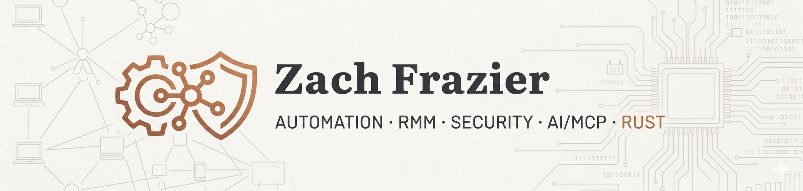

---

I focus on bridging the gap between DevOps and managed services. Most of my work revolves around automating workflows, building integrations for RMM platforms, and creating developer tooling that makes IT operations more efficient.

---

**Languages**

---

**Infrastructure & Tools**

---

**AI & LLMs**

---

### Featured Projects

- **[NCRestAPI](https://github.com/theonlytruebigmac/NCRestAPI)** — PowerShell module for interacting with the N-able N-central REST API. Simplifies authentication, device queries, and management tasks across N-central environments.

- **[N-central MCP](https://github.com/theonlytruebigmac/N-central_MCP)** — AI-native Model Context Protocol server for N-able N-central. Enables LLM-driven RMM platform management, reporting, and automation.

- **[NCRelay](https://github.com/theonlytruebigmac/NCRelay)** — Notification relay service that receives XML data via custom API endpoints and forwards alerts to Slack, Discord, Microsoft Teams, and webhooks.

- **[homelab-mcp](https://github.com/theonlytruebigmac/homelab-mcp)** — MCP server for homelab infrastructure management. Control and monitor your homelab through AI-powered tooling.

- **[screencontrol](https://github.com/theonlytruebigmac/screencontrol)** — Rust-based open source remote control solution.

---

### Connect

